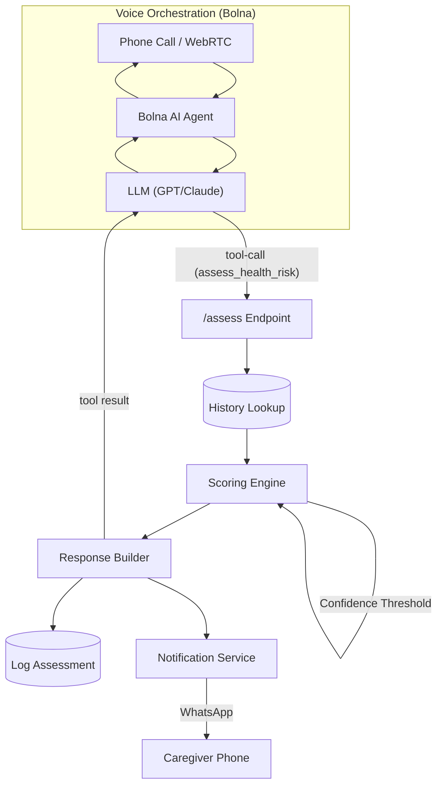
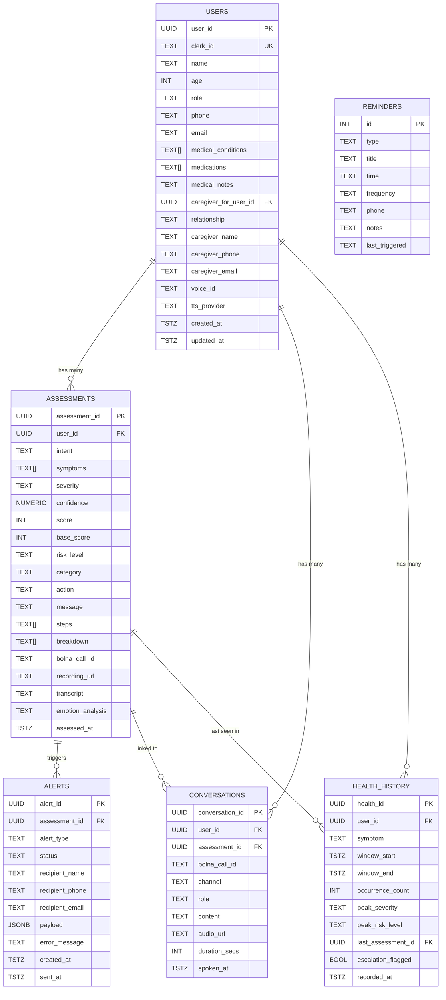

# WellRing Architecture

## System Flow



## Key Components

1. **Voice Orchestration (Bolna)**
   - Handles real-time WebRTC and telephony via Bolna AI.
   - LLM extracts structured `intent`, `symptoms`, `severity`, and `confidence` via the `assess_health_risk` tool call.

2. **Scoring Engine (`src/scoring_engine/`)**
   - Applies baseline weights to symptoms (`rules.py`).
   - Escalates score if symptoms repeat frequently (History Multiplier).
   - Downgrades confidence and forces follow-up if LLM certainty is low (<40%).
   - Outputs a human-readable `breakdown` of the calculation.

3. **Backend Service (`src/main.py`)**
   - FastAPI REST API integrating the scoring engine.
   - Background scheduler for medicine/checkup/call reminders.
   - Context-aware outbound call endpoint (`/call`) with health history injection.
   - Profile onboarding and family contact management.

4. **Database (`src/database.py`)**
   - Multi-backend data-access layer.
   - **PostgreSQL** (primary, via `DATABASE_URL`) — full schema with users, assessments, alerts, conversations, health_history, reminders.
   - **Supabase** (alternative managed Postgres, via `USE_SUPABASE`).
   - **SQLite** (local fallback for dev/tests).

5. **Notification System (`src/notifications.py`)**
   - Triggers Twilio WhatsApp alerts to caregivers for HIGH and CRITICAL risk levels.
   - Optional routine daily updates for LOW/MEDIUM.
   - Supports multiple family contacts per patient.

6. **Local Voice Testing (`voice_health.py`)**
   - Standalone hardware testing script using Whisper (STT) + Gemini (NLU) + Piper (TTS).
   - Requires local microphone and speaker — not used in production.

---

## Database Architecture

> Primary key is **phone number** for user lookup. All cross-table joins use `user_id` (UUID).

### Entity-Relationship Diagram



---

### Table 1 — `users`
Primary store for **elderly patients** and their linked **caregivers**.

| Column | Type | Notes |
|---|---|---|
| `user_id` | `UUID PK` | Auto-generated, used for all joins |
| `clerk_id` | `TEXT UNIQUE` | Firebase Auth UID — login link |
| `name` | `TEXT NOT NULL` | Display name |
| `age` | `INTEGER` | Validated: 1–149 |
| `role` | `TEXT` | `'elderly'` or `'caregiver'` |
| `phone` | `TEXT` | **Primary lookup key** from voice system |
| `email` | `TEXT` | Optional |
| `medical_conditions` | `TEXT[]` | e.g. `['diabetes', 'hypertension']` |
| `medications` | `TEXT[]` | Current prescriptions |
| `medical_notes` | `TEXT` | Free-form clinical notes |
| `caregiver_for_user_id` | `UUID FK → users` | If this row IS a caregiver |
| `relationship` | `TEXT` | e.g. `'son'`, `'daughter'` |
| `caregiver_name` | `TEXT` | Denormalised for fast alert lookup |
| `caregiver_phone` | `TEXT` | WhatsApp alert target |
| `caregiver_email` | `TEXT` | Optional email alert target |
| `voice_id` | `TEXT` | ElevenLabs / TTS voice clone ID |
| `tts_provider` | `TEXT` | Default: `'elevenlabs'` |
| `created_at` | `TIMESTAMPTZ` | Auto-set |
| `updated_at` | `TIMESTAMPTZ` | Auto-updated via trigger |

**Indexes:** `role`, `caregiver_for_user_id`

---

### Table 2 — `assessments`
One row per **voice call health check-in** that triggers a risk score.

| Column | Type | Notes |
|---|---|---|
| `assessment_id` | `UUID PK` | |
| `user_id` | `UUID FK → users` | Cascade delete |
| `intent` | `TEXT` | Default: `'health_issue'` |
| `symptoms` | `TEXT[]` | e.g. `['chest_pain', 'dizziness']` |
| `severity` | `TEXT` | `low / medium / high / critical` |
| `confidence` | `NUMERIC(4,3)` | 0.000 – 1.000 (LLM certainty) |
| `score` | `INTEGER` | Final risk score after all multipliers |
| `base_score` | `INTEGER` | Raw score before history multiplier |
| `risk_level` | `TEXT` | `LOW / MEDIUM / HIGH / CRITICAL` |
| `category` | `TEXT` | e.g. `CARDIAC`, `NEUROLOGICAL`, `FALL` |
| `action` | `TEXT` | e.g. `notify_caregiver_and_emergency_services` |
| `message` | `TEXT` | Human-readable assessment summary |
| `steps` | `TEXT[]` | Recommended next steps |
| `breakdown` | `TEXT[]` | Scoring calculation explanation |
| `bolna_call_id` | `TEXT` | Bolna session ID |
| `recording_url` | `TEXT` | Call recording link |
| `transcript` | `TEXT` | Full call transcript |
| `emotion_analysis` | `TEXT` | Voice tone/emotion summary |
| `assessed_at` | `TIMESTAMPTZ` | Default: `now()` |

**Indexes:** `user_id`, `risk_level`, `assessed_at DESC`, `symptoms` (GIN for `@>` array queries)

---

### Table 3 — `alerts`
Every **notification sent** after an assessment. One assessment → many alerts.

| Column | Type | Notes |
|---|---|---|
| `alert_id` | `UUID PK` | |
| `assessment_id` | `UUID FK → assessments` | Cascade delete |
| `alert_type` | `TEXT` | `sms / call / email / push / emergency_services / in_app` |
| `status` | `TEXT` | `pending / sent / delivered / failed` |
| `recipient_name` | `TEXT` | Who was notified |
| `recipient_phone` | `TEXT` | |
| `recipient_email` | `TEXT` | |
| `payload` | `JSONB` | Raw API payload / Twilio response |
| `error_message` | `TEXT` | Set if `status = 'failed'` |
| `created_at` | `TIMESTAMPTZ` | |
| `sent_at` | `TIMESTAMPTZ` | Null until delivery confirmed |

**Indexes:** `assessment_id`, `status`, `alert_type`

> The **Nemotron Watchdog** queries this table for `status = 'failed'` or missing rows to detect missed alerts and auto-retry.

---

### Table 4 — `conversations`
Individual **turn-by-turn messages** between the elder and Alice.

| Column | Type | Notes |
|---|---|---|
| `conversation_id` | `UUID PK` | |
| `user_id` | `UUID FK → users` | Cascade delete |
| `assessment_id` | `UUID FK → assessments` | Optional — set if call triggered an assessment |
| `bolna_call_id` | `TEXT` | Session grouping key |
| `channel` | `TEXT` | `web / phone / whatsapp` |
| `role` | `TEXT` | `user / assistant / system` |
| `content` | `TEXT NOT NULL` | The message text |
| `audio_url` | `TEXT` | Per-turn audio clip |
| `duration_secs` | `INTEGER` | Turn duration |
| `spoken_at` | `TIMESTAMPTZ` | Default: `now()` |

**Indexes:** `user_id`, `bolna_call_id`, `spoken_at DESC`

---

### Table 5 — `health_history`
Aggregated **symptom trend windows** used by the scoring engine's history multiplier.

| Column | Type | Notes |
|---|---|---|
| `health_id` | `UUID PK` | |
| `user_id` | `UUID FK → users` | Cascade delete |
| `symptom` | `TEXT NOT NULL` | Matches `scoring_engine/rules.py` key |
| `window_start` | `TIMESTAMPTZ` | Start of the aggregation window |
| `window_end` | `TIMESTAMPTZ` | End of the aggregation window |
| `occurrence_count` | `INTEGER` | How many times symptom appeared in window |
| `peak_severity` | `TEXT` | `low / medium / high / critical` |
| `peak_risk_level` | `TEXT` | `LOW / MEDIUM / HIGH / CRITICAL` |
| `last_assessment_id` | `UUID FK → assessments` | Most recent triggering assessment |
| `escalation_flagged` | `BOOLEAN` | `TRUE` when count crosses escalation threshold |
| `recorded_at` | `TIMESTAMPTZ` | Default: `now()` |

**Indexes:** `user_id`, `symptom`, composite `(user_id, symptom, window_start DESC)`

---

### Table 6 — `reminders`
Scheduled **call / medication / checkup reminders** for the background scheduler.

| Column | Type | Notes |
|---|---|---|
| `id` | `SERIAL PK` | |
| `type` | `TEXT NOT NULL` | e.g. `'medicine'`, `'checkup'`, `'call'` |
| `title` | `TEXT NOT NULL` | Display name |
| `time` | `TEXT NOT NULL` | e.g. `'08:00'` (HH:MM in IST) |
| `frequency` | `TEXT NOT NULL` | e.g. `'daily'`, `'weekly'` |
| `phone` | `TEXT NOT NULL` | Elder's phone — used to place the reminder call |
| `notes` | `TEXT` | Additional context |
| `last_triggered` | `TEXT` | ISO timestamp of last successful trigger |

---

### Data Flow Summary

```
Phone call arrives
       │
       ▼
  users (lookup by phone)
       │
       ▼
  assessments (one row per call)
       │
       ├──► alerts (WhatsApp per assessment)
       │         └── Nemotron Watchdog retries failed rows
       │
       ├──► conversations (each turn stored)
       │
       └──► health_history (symptom trend aggregation)
                  └── Scoring Engine reads this for history multiplier
```

### Multi-Backend Strategy

| Backend | When Used | Connection |
|---|---|---|
| **PostgreSQL** | Production (Supabase / Cloud) | `DATABASE_URL` env var |
| **Supabase** | Managed Postgres alternative | `USE_SUPABASE=true` + `SUPABASE_URL` |
| **SQLite** | Local dev & all automated tests | `wellring.db` file |

The `src/database.py` layer auto-detects which backend to use and presents a **single unified API** to all callers — no changes needed in `main.py` when switching backends.
