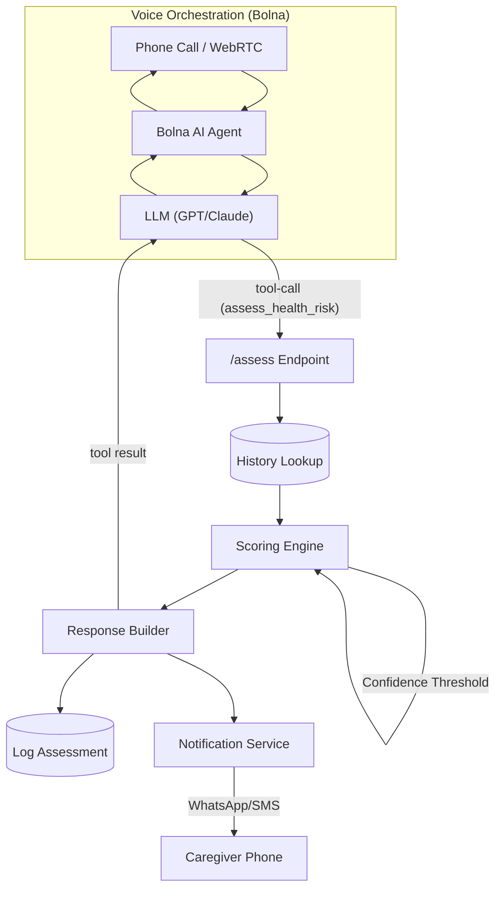

# WellRing Architecture

## System Flow

## Key Components

1. **Voice Orchestration (Bolna)**
   - Handles real-time WebRTC and telephony via Bolna AI.
   - LLM extracts structured `intent`, `symptoms`, `severity`, and `confidence` via the `assess_health_risk` tool call.

2. **Scoring Engine (`src/scoring_engine/`)**
   - Applies baseline weights to symptoms (`rules.py`).
   - Escalates score if symptoms repeat frequently (History Multiplier).
   - Downgrades confidence and forces follow-up if LLM certainty is low (<40%).
   - Outputs a human-readable `breakdown` of the calculation.

3. **Backend Service (`src/main.py`)**
   - FastAPI REST API integrating the scoring engine.
   - Background scheduler for medicine/checkup/call reminders.
   - Context-aware outbound call endpoint (`/call`) with health history injection.
   - Profile onboarding and family contact management.

4. **Database (`src/database.py`)**
   - Multi-backend data-access layer.
   - **PostgreSQL** (primary, via `DATABASE_URL`) — full schema with users, assessments, alerts, conversations, health_history, reminders.
   - **Supabase** (alternative managed Postgres, via `USE_SUPABASE`).
   - **SQLite** (local fallback for dev/tests).

5. **Notification System (`src/notifications.py`)**
   - Triggers Twilio WhatsApp/SMS alerts to caregivers for HIGH and CRITICAL risk levels.
   - Optional routine daily updates for LOW/MEDIUM.
   - Supports multiple family contacts per patient.

6. **Local Voice Testing (`voice_health.py`)**
   - Standalone hardware testing script using Whisper (STT) + Gemini (NLU) + Piper (TTS).
   - Requires local microphone and speaker — not used in production.
